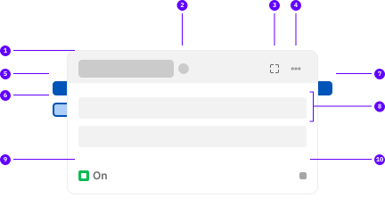

# Blocks

A block is a small actor/process that perform some predefine action. Flows comes in-built with some predefined blocks. A block starts executing when it has some data in all of it's input ports.

> This page is maintained as a source of truth for all the blocks that are available within Flows. Use the ideas section of discussion to suggest any modifications in behavior to the existing blocks or any ideas for new blocks. 

## Anatomy
----

==- 1 - **Name**
This is the name of the block
==- 2 - **Run State**
This is the run state of the block
==- 3 - **Expand**
Expand to configuration and information about the block
==- 4 - **Options**
Contains additional options for the block
==- 5 - **Required Input Port**
This is a required port and needs a connection for the block to be executable
==- 6 - **Optional Input Port**
This is an optional port and block will execute even if there is not connection of the port
==- 7 - **Output Port**
This is the output port where the result of the block is emitted
==- 8 - **Configuration**
These are the quick configuration for blocks. Some configuration may not be shown here.
==- 9 - **Signal Input**
This is the signal port that can be connected to prevent the execution of the block until the
signal turns high.
==- 10 -  **Signal Output**
This is the signal output port that emits a high signal when the block completes its processing.
===

## Stability
The block is an living standard and blocks go through a life-cycle as mentioned below

1. [!badge text="Proposed" variant="secondary"] - This is proposed block that has not been implemented yet.

2. [!badge text="Experimental" variant="primary"] - This is a block that has been implement, but the API is not stable yet and may change before becoming stable. 

3. [!badge text="Stable" variant="success"] - This a block who API's have been frozen and no changes would be made.

4. [!badge text="Deprecated" variant="warning"] - This is a block which is no longer maintained or there is a newer better alternative block available as a replacement.

5. [!badge text="Removed" variant="danger"] - This is a block that once existed but is longer is available to be used.
