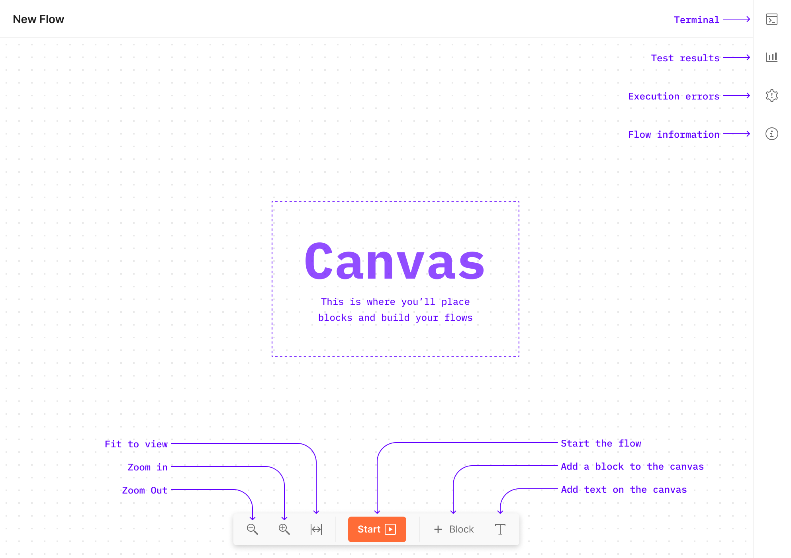
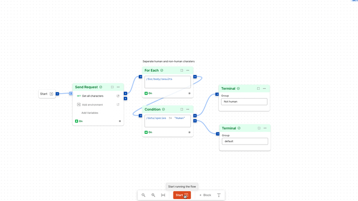
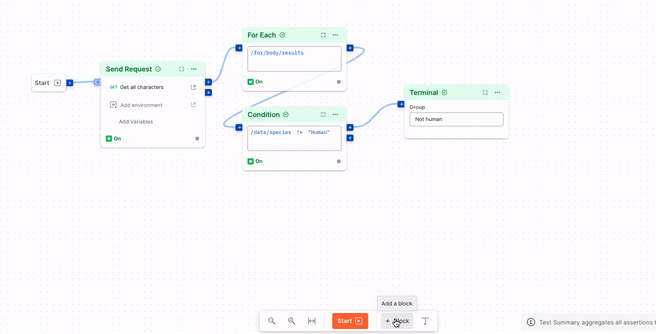
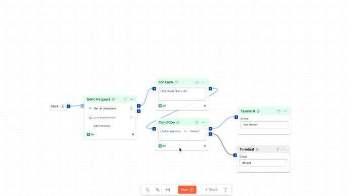

# The Interface

## Toolbar
The toolbar gives you access to tools you can use to manipulate the canvas.

+++ Zoom controls 

Use the toolbar to zoom in or out the canvas. Fit-to-view adjusts the zoom level to fit your entire flow on the visible canvas.

You can also hold down `ctrl`/`cmd` scroll to zoom in or out
+++ Start

Use the start button to execute the flow you've built on the canvas. the start button changes to stop during an active run, which can be used to, well, stop the flow.

+++ + Block

The tool bar lets you add a block to the canvas as well. Click on the `+ Block` button and you're presented with a list of the available blocks
+++ Text

You can add rich markdown on the canvas to describe what your flow is doing. Just click on the `T` or Text icon on the toolbar and place the text block on the canvas.
+++

## Context bar
The context bar is the place where you'll see more information about your flow and it's current state.

+++ Terminal

+++ Test Summary

+++