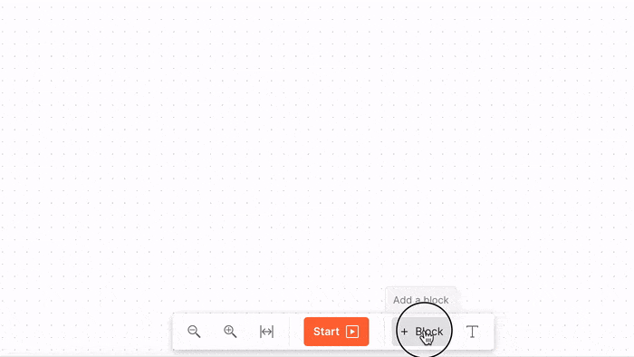
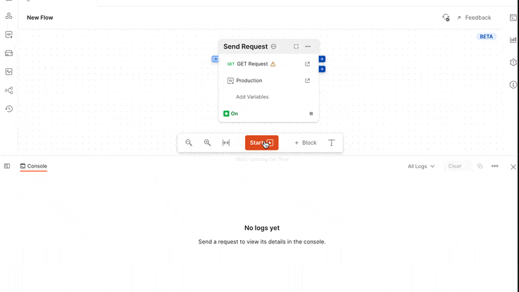

# Level 1 - Sending a request

### 1. Add the [Send Request](../blocks/send-request.md) block

Click on the `+ Block` button on the toolbar and select a block from the list
to add to your canvas. Alternatively, you can use the shortcut `A` with canvas in
focus.

### 2. Select a Request

Click on the `Add request to send` config for the block and select one of the requests present
in your workspace.

!!!success
Flows can only use requests that have been saved in a collection. So [create a collection with a request](https://learning.postman.com/docs/getting-started/creating-the-first-collection/)
if you have not already done that.
!!!

!!!info
After selecting the request, you may notice a warning on the config about examples. You can ignore that for now,
but it will become important in the later tutorials.
!!!

### 3. Select an Environment (optional)

Usually collections and request have their associated environment variables where secrets or environment specific
config may be stored. If you have any such environments present select it.

!!!warning
Environment and variable in postman were originally designed for Collection. When using Flows, you will
notice few differences.
1. The environment selected in the top of your workspace has **no effect** on flows, instead an environment
   has to be selected for each of the Send Request block
2. Updating environment,globals, etc using the `pm.environment.set` APIs in the test and pre-request script
   have **no effect**.

Why this breaking change? [Read more](https://github.com/postmanlabs/postman-flows/discussions/142).
!!!

### 4. Start the Flow

Finally, click on the `Start` button in the toolbar and you will notice that the block starts executing.
If you have not gone through the [Fundaments](/#fundamentals) and [Block Anatomy](../getting-started/blocks.md) yet, 
now will be a good time.

The input is **optional** and there is *no connection*, therefore the block starts
running immediately when flow starts. The block header turns blue when it's sunning,
and after the block completes running the header becomes green.

!!!
The `Send Request` block become green even if the response sent by the Send Request block is a non-200 status code, like 403 or 500.
Flows tried to remain un-opinionated about HTTP Request or any other block. The success of the block denotes that flows was successfully able
to execute the block and in this case send a request and receive a response back.
!!!
